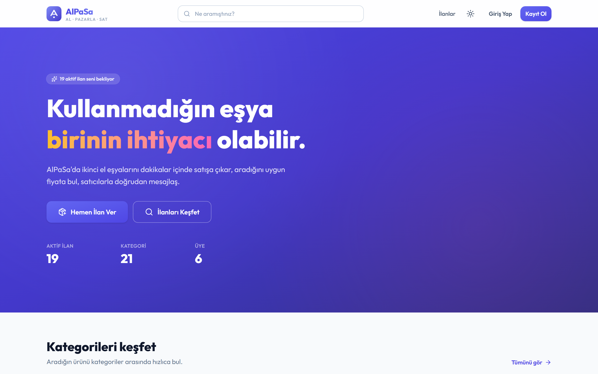
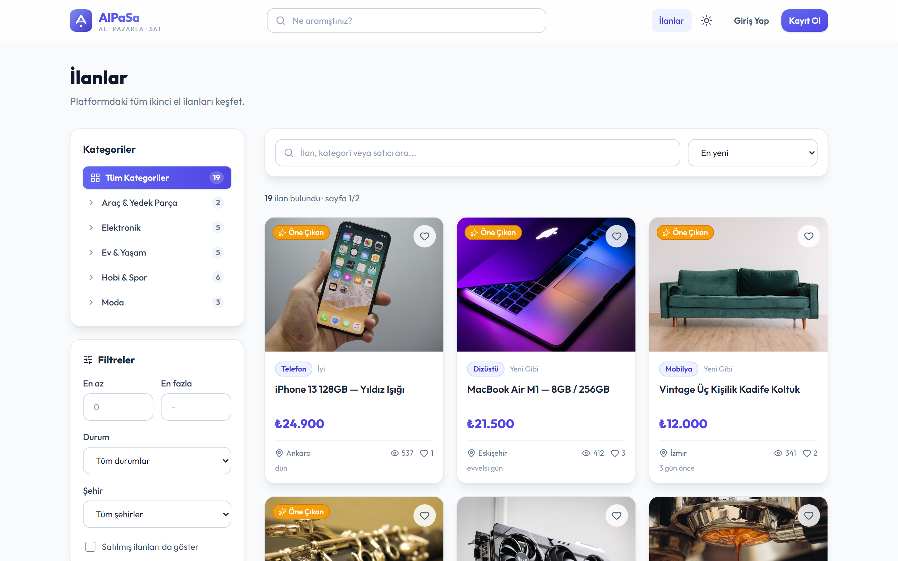
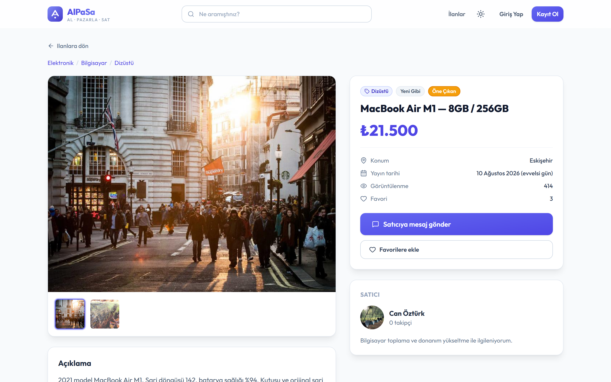
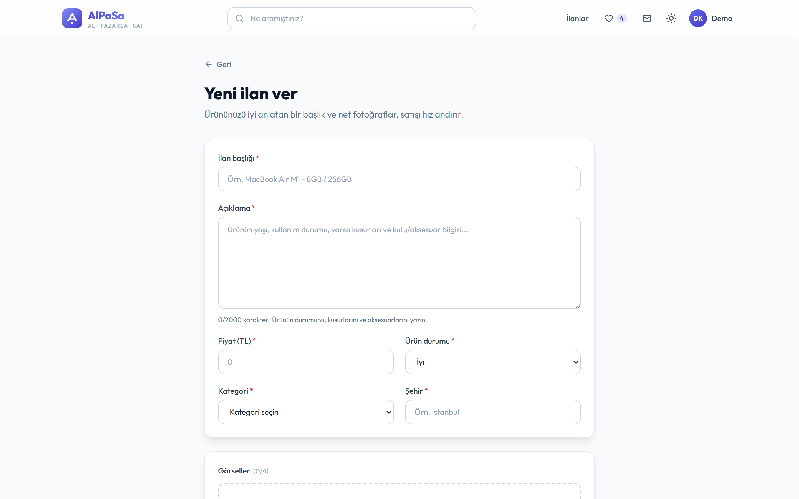
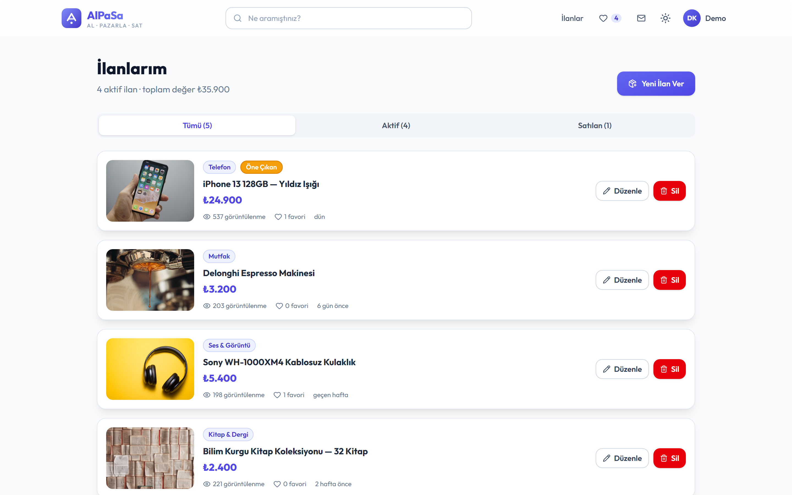
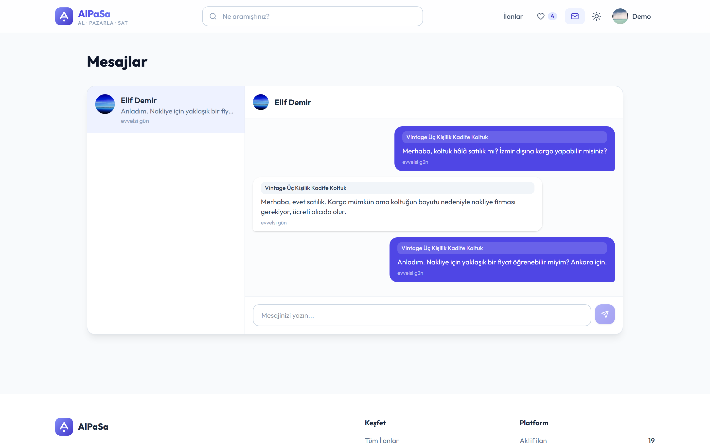
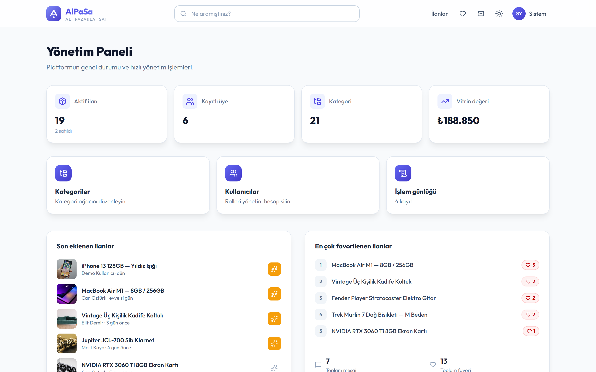
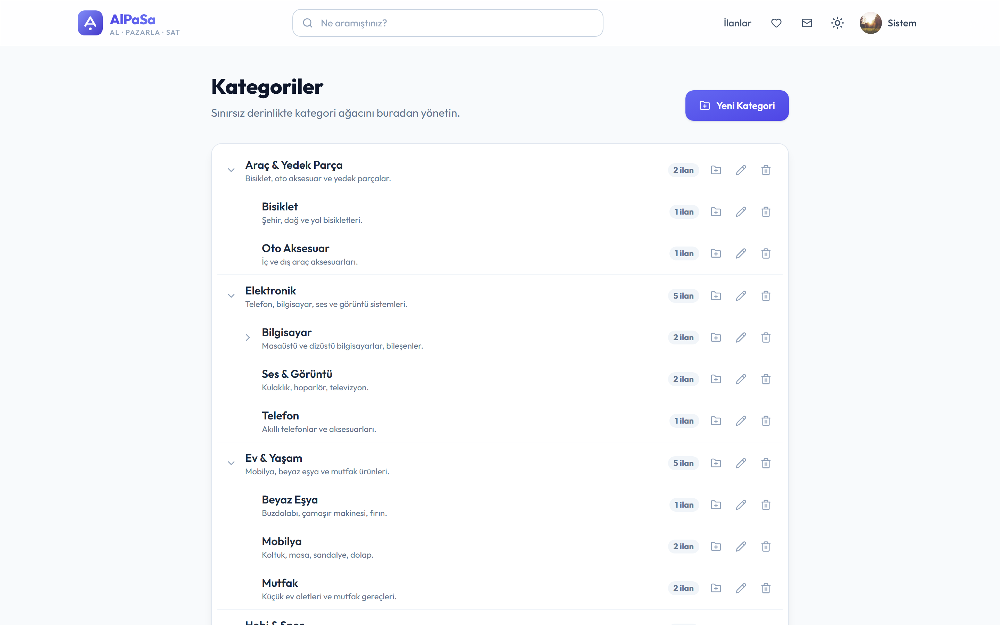
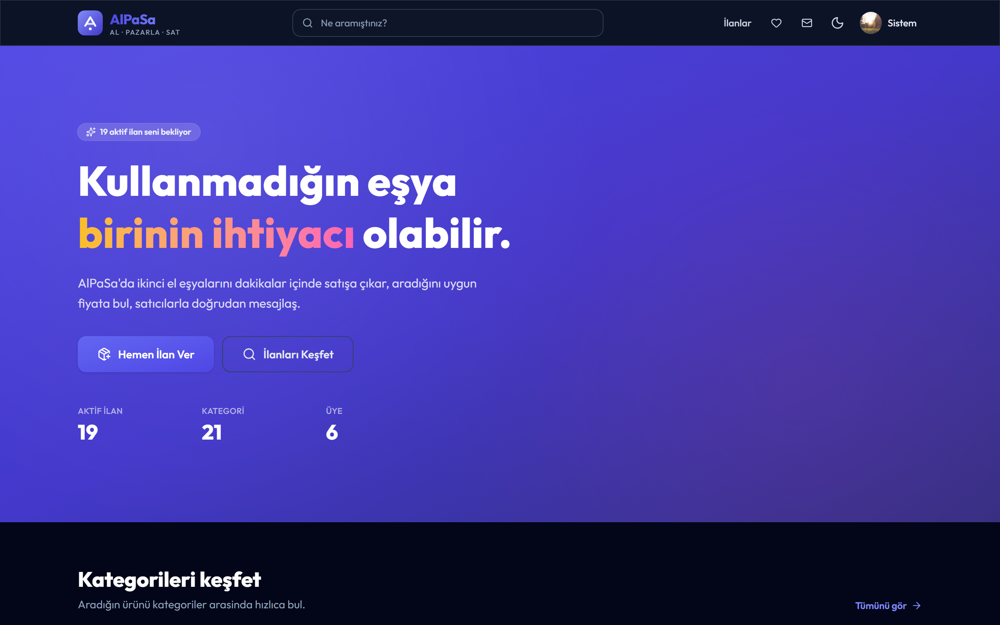
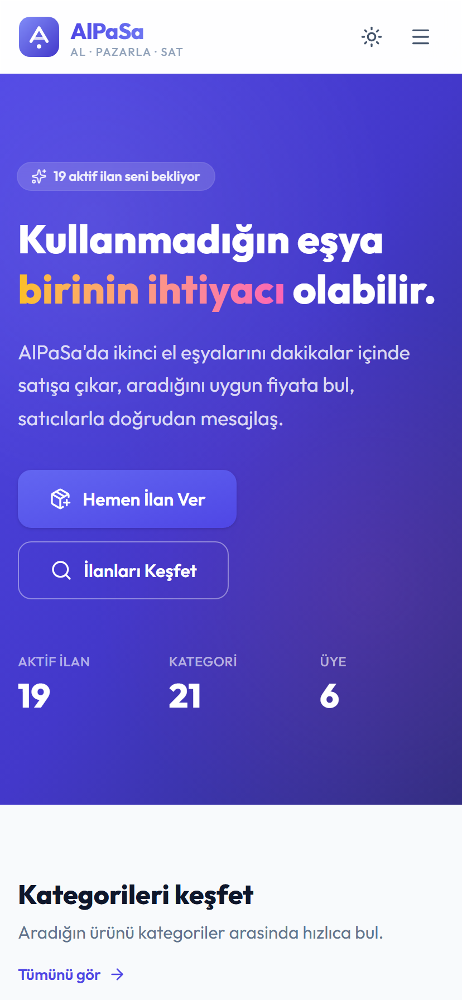

# AlPaSa

Al, Pazarla, Sat. Kullanılmayan eşyaların satışa çıkarıldığı, ilanların filtrelenip arandığı ve satıcıyla mesajlaşılabilen bir ikinci el alışveriş platformu.

React 19, TypeScript, Vite ve Tailwind CSS v4 ile yazılmış tek sayfa bir uygulama. Backend yok, bütün veriler tarayıcının `localStorage` alanında tutuluyor. Bu yüzden kurulum, veritabanı ya da sunucu gerektirmiyor.

Canlı sürüm: https://yigitkalaycioglu.github.io/AlPaSa-Second-Hand-Trading-and-Social-Interaction-Platform/

<p align="center">
  
</p>

## Demo hesapları

Uygulama ilk açıldığında örnek verilerle doluyor: 6 kullanıcı, 21 kategori, 21 ilan ve mesaj geçmişi. Giriş ekranındaki kartlara tıklayarak da giriş yapılabiliyor.

| Rol | E-posta | Parola |
|---|---|---|
| Yönetici | `admin@alpasa.app` | `Admin123` |
| Kullanıcı | `demo@alpasa.app` | `Demo123` |

Kayıt ekranından yeni hesap da açılabiliyor. Profil sayfasındaki "Verileri sıfırla" butonu her şeyi başlangıç durumuna döndürüyor.

## Ekran görüntüleri

| Ana sayfa | İlan listesi |
|---|---|
|  |  |

| İlan detayı | Yeni ilan |
|---|---|
|  |  |

| İlanlarım | Mesajlar |
|---|---|
|  |  |

| Yönetim paneli | Kategori yönetimi |
|---|---|
|  |  |

| Karanlık tema | Mobil görünüm |
|---|---|
|  |  |

## Özellikler

İlanlar:

- Görsel yüklemeli ve alan doğrulamalı ilan formu (`/ilan/yeni`). Düzenleme aynı formu kullanıyor ve ilanın sahibini kontrol ediyor.
- Listeleme sayfasında arama, iç içe kategori filtresi, fiyat/durum/şehir filtreleri, 6 sıralama seçeneği ve sayfalama.
- Silme işlemi onay penceresinden geçiyor, ilana bağlı favori kayıtları da temizleniyor.

Kullanıcı tarafı:

- Kayıt, giriş ve çıkış. Parolalar düz metin olarak değil SHA-256 özeti olarak saklanıyor.
- `Admin` ve `User` rolleri, korumalı rotalar.
- Favoriler, satıcıya ilan üzerinden mesaj gönderme, okunmamış mesaj rozeti.
- Satıcı profilleri ve takip etme.
- Profil bilgileri ve parola değiştirme.

Yönetici tarafı:

- İstatistikler, son ilanlar ve en çok favorilenen ilanların olduğu panel.
- Sınırsız derinlikte kategori ağacı için ekleme, düzenleme ve silme.
- Kullanıcıların rolünü değiştirme ve hesap silme (ilişkili verilerle birlikte).
- Yönetici işlemlerinin kaydı.

Bunların yanında karanlık/aydınlık tema, mobil uyumlu arayüz, yüklenen fotoğrafların tarayıcıda küçültülmesi, klavyeyle gezinme ve `prefers-reduced-motion` desteği var.

## Çalıştırma

Node.js 20 veya üzeri gerekiyor.

```bash
git clone https://github.com/yigitkalaycioglu/AlPaSa-Second-Hand-Trading-and-Social-Interaction-Platform.git
cd AlPaSa-Second-Hand-Trading-and-Social-Interaction-Platform
npm install
npm run dev
```

Uygulama http://localhost:5173 adresinde açılıyor. Diğer komutlar:

```bash
npm run build       # tip kontrolü ve üretim derlemesi (dist/)
npm run preview     # derlenmiş sürümü yerelde açar
npm run lint
npm run typecheck
```

## Klasör yapısı

```
src/
  components/   category, common, layout, product ve ui bileşenleri
  context/      Store, Auth, Theme ve Toast sağlayıcıları
  hooks/        useStore, useAuth, useTheme, useToast, useDebounce
  interfaces/   User, Product, Category, Social (favori, takip, mesaj, log) modelleri
  lib/          localStorage katmanı, demo veri, parola özetleme, görsel küçültme, filtreler
  pages/        sayfalar, admin/ altında yönetici sayfaları
docs/screenshots/
.github/workflows/deploy-pages.yml
```

## Teknik notlar

Sağlayıcıların sırası `Theme → Toast → Store → Auth` şeklinde. `Store` depolama kotası dolduğunda bildirim göstermek için `Toast`'a, `Auth` de kullanıcı kayıtlarını okumak için `Store`'a ihtiyaç duyuyor.

Demo veri, parola özetleri Web Crypto ile hesaplandığı için asenkron hazırlanıyor. Bu iş React ağacı oluşturulmadan önce `lib/bootstrap.ts` içinde bir kez yapılıyor. Böylece bileşenler `localStorage`'ı senkron okuyabiliyor ve ayrı bir "yükleniyor" durumu gerekmiyor.

Oturum ilk başta bir `useEffect` içinde geri yükleniyordu. Bu yüzden korumalı bir sayfada F5'e basınca ilk render'da kullanıcı giriş sayfasına atılıyordu. Şimdi `AuthProvider` oturumu ilk state değeri olarak doğrudan `localStorage`'dan okuyor.

Her koleksiyon (ilanlar, mesajlar, favoriler...) ayrı bir `localStorage` anahtarında duruyor. Bir mesaj yazıldığında bütün ilan listesinin ve içindeki base64 görsellerin yeniden yazılmasına gerek kalmıyor.

`localStorage` yaklaşık 5 MB ile sınırlı olduğu için yüklenen görseller canvas üzerinde en fazla 1000 piksele küçültülüp JPEG olarak kaydediliyor. 4 MB'lık bir fotoğraf yaklaşık 100 KB'a iniyor. Kota yine de dolarsa değişiklik geri alınıyor ve kullanıcıya uyarı gösteriliyor. `localStorage` tamamen kapalıysa (örneğin gizli sekmede) uygulama bellek içi bir yedekle çalışmaya devam ediyor.

Kategori ağacında bir kategori kendi alt kategorisinin altına taşınamıyor, alt kategorisi ya da ilanı olan bir kategori de silinemiyor.

## Yayın (GitHub Pages)

`main` dalına her gönderimde `.github/workflows/deploy-pages.yml` uygulamayı derleyip GitHub Pages'e yayınlıyor. Site depo adının altında açıldığı için derlemede `BASE_PATH` ortam değişkeniyle Vite'ın `base` ayarı ve React Router'ın `basename` değeri bu yola göre ayarlanıyor. `/ilanlar` gibi adreslerin doğrudan açılabilmesi için derleme çıktısındaki `index.html`, `404.html` olarak da kopyalanıyor.

Yerelde `npm run dev` ile ya da `npm run build && npm run preview` ile kök adreste çalışır.

## Bilinen sınırlar

- Veriler tarayıcıya özel. Başka bir cihazdan girildiğinde aynı ilanlar görünmüyor, kullanıcılar birbirinin ilanını gerçek zamanlı göremiyor.
- Kimlik doğrulama gerçek bir güvenlik sınırı değil. Parolalar özetlense de `localStorage`'ı okuyabilen herkes verilere erişebilir. Gerçek bir uygulamada doğrulama sunucuda, bcrypt veya argon2 gibi bir algoritmayla yapılmalı.
- Depolama yaklaşık 5 MB ile sınırlı olduğu için eklenebilecek ilan sayısı da sınırlı.
- Demo ilanların görselleri uzak bir kaynaktan geliyor. İnternet yoksa başlıktan üretilen SVG yer tutucular gösteriliyor.

Bir REST API ve PostgreSQL eklenecek olursa `src/lib/storage.ts` arayüzü korunarak sadece veri katmanı değiştirilebilir.

## Lisans

MIT
